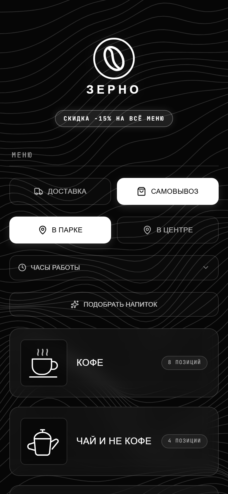
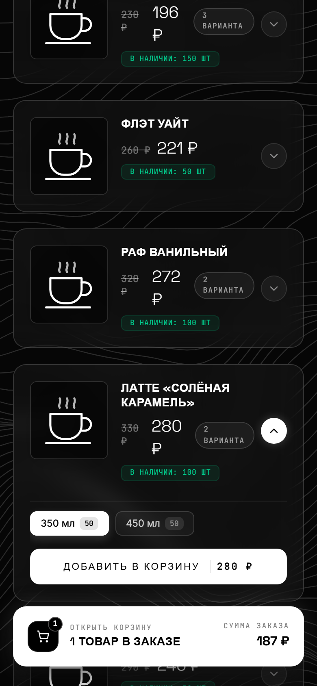
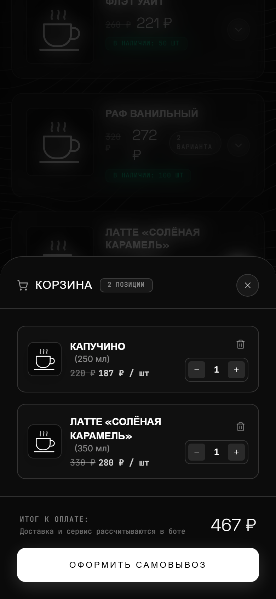
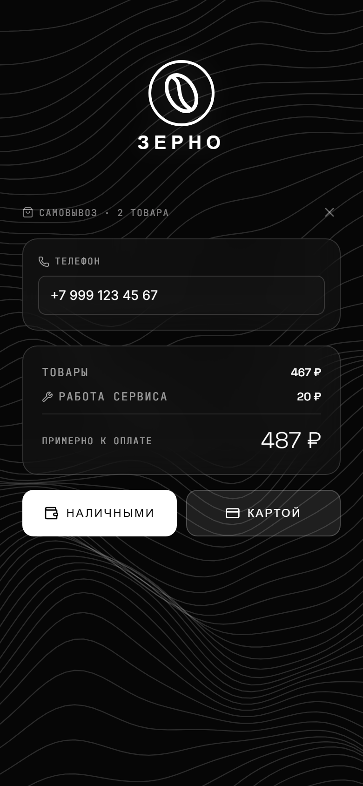
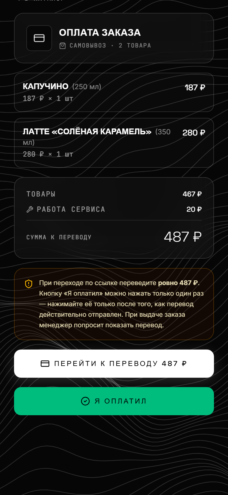
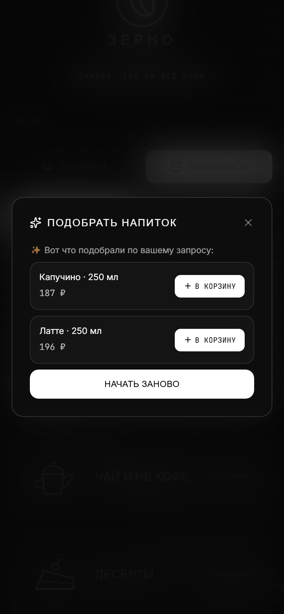
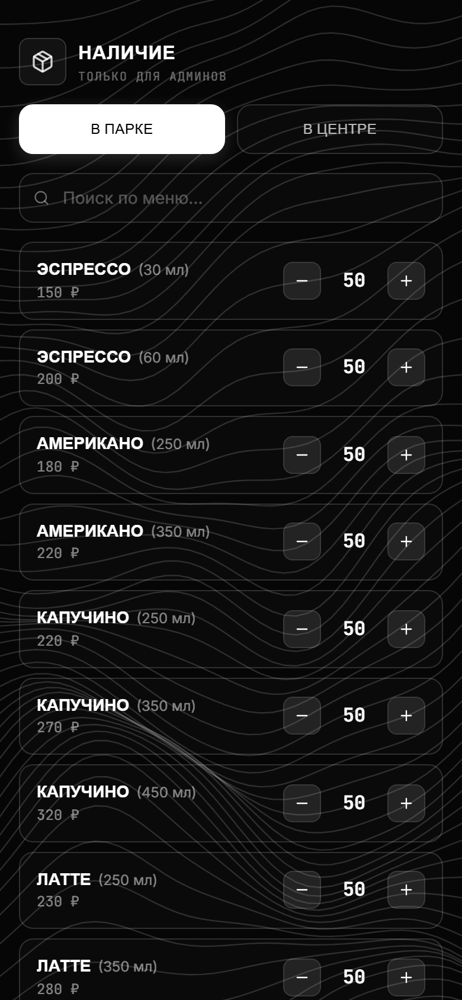

# Telegram Shop Mini App: bot + FastAPI + React

[Русский](README.md) | **English**

A complete shop that lives inside Telegram. Customers open the menu right in the chat with the bot, fill a cart, choose delivery or pickup and pay. Managers receive orders in their group chat and confirm them with one tap; the owner gets revenue reports.

The repository ships with a demo coffee shop "Zerno" with two locations. The shop name, locations, menu and categories are configured in two files — see [Adapting it to your business](#adapting-it-to-your-business). The UI is in Russian; all texts are plain strings and easy to translate.

| Menu | Product variants | Cart | Checkout |
|:---:|:---:|:---:|:---:|
|  |  |  |  |
| **Payment** | **"Find a drink" quiz** | **Stock management** | |
|  |  |  | |

## Features

**For customers**
- Telegram Mini App menu: categories, product variants (size, flavour), search, live stock;
- delivery or pickup from one of the locations, each with its own stock;
- delivery price by address: Yandex Geocoder + real road distance from a self-hosted OSRM router;
- the whole checkout inside the app: remembered phone number, address, cash or payment-link payment;
- a "find a drink" quiz that adds the result straight to the cart;
- store-wide discounts configured via environment variables.

**For managers**
- orders arrive in the managers' group with "Handed over" / "Cancel" buttons;
- stock is reserved when an order is placed and released on cancellation or after 24 hours without confirmation;
- stock management (+1 / −1) from the phone, right in the Mini App.

**For the owner**
- daily, weekly, monthly and quarterly reports per location: cash, card net of acquiring fees, delivery, service fee;
- manager payroll calculated per handed-over item;
- automatic report for the previous day at midnight and a daily database backup sent to Telegram;
- broadcast to all customers with preview and confirmation;
- optional channel-subscription gate: the shop works only for subscribers of a given channel.

**Security**
- prices, stock and totals are recalculated on the server — the client sends only product ids and quantities;
- every Mini App request is signed: Telegram `initData` HMAC validation with an expiry, or a bot-signed link;
- admin endpoints accept only fresh `initData` from user ids listed in `ADMINS_ID`;
- all-or-nothing stock deduction in a single transaction, protection against duplicated cart lines and against ordering items from another location;
- the Mini App does not open in a regular browser, unsigned API calls get 403, the app port is not exposed, HTTPS via Caddy.

## Tech stack

| Part | Technologies |
|---|---|
| Bot | Python 3.11, aiogram 3 (long polling, FSM) |
| API | FastAPI, Pydantic, aiosqlite (SQLite) |
| Background jobs | APScheduler |
| Mini App | React 19, TypeScript, Vite, Tailwind CSS 4, motion |
| Delivery | Yandex Geocoder, OSRM (OpenStreetMap), geopy |
| Infrastructure | Docker Compose (multi-stage build), Caddy |

## Architecture

```
Telegram ──► bot (aiogram) ─┐
                            ├─ single process main.py ──► SQLite (shop.db)
Mini App (React) ► FastAPI ─┘         │
                                      ├──► Yandex Geocoder (address → coordinates)
                                      └──► OSRM (road distance)
```

The bot and the API run in one process and share one `Bot` instance, so the API posts orders to the managers' group directly. FastAPI serves both the JSON API and the built Mini App from the same origin — no CORS needed.

| File | Responsibility |
|---|---|
| `main.py` | entry point: database, uvicorn, scheduler, bot polling |
| `server_api.py` | REST API for the Mini App, signature checks, discounts, static files |
| `handlers/routes.py` | bot: `/start`, FAQ, manager order flow, `/admin`, broadcasts |
| `handlers/shop_dp.py` | database schema, stock, reports, demo menu |
| `handlers/delivery.py` | delivery price |
| `handlers/cron.py` | daily report, database backup, expiry of unconfirmed orders |
| `handlers/subscription.py` | channel-subscription check |
| `webapp/src/shop.ts` | shop name, locations, opening hours, categories |
| `webapp/src/App.tsx` | menu and cart |
| `webapp/src/components/` | checkout, payment, quiz, stock management |

## Getting started

### Locally

```bash
cp .env.example .env            # set BOT_TOKEN, WEBAPP_URL, MANAGER_CHAT_ID, ADMINS_ID, SHOP_COORD
pip install -r requirements.txt
cd webapp && npm ci && npm run build && cd ..
python main.py                  # bot + API on :8000; the demo menu is seeded on first run
```

Telegram opens Mini Apps over HTTPS only. For local testing, expose port 8000 through a tunnel (e.g. `cloudflared tunnel --url http://localhost:8000`) and put the URL into `WEBAPP_URL`.

Frontend development with hot reload: `cd webapp && npm run dev` (Vite on :3000, proxies `/api` to :8000). Type check: `npm run lint`.

### On a server (Docker + Caddy)

```bash
git clone <repo> /opt/shop && cd /opt/shop
cp .env.example .env && nano .env
touch shop.db                   # otherwise Docker creates a directory instead of a file
bash osrm/prepare.sh            # one-time: city map for delivery distances
docker compose up --build -d
```

`/etc/caddy/Caddyfile`:

```
shop.example.com {
    reverse_proxy 127.0.0.1:8000
}
```

OSRM is optional: without it the distance falls back to straight line × 1.4 and checkout keeps working. The map region is set with `REGION_URL` and `BBOX` in `osrm/prepare.sh`.

## Adapting it to your business

1. **Locations:** `LOCATION_NAMES` and `DELIVERY_LOCATION` in `handlers/shop_dp.py`, the same keys in `PICKUP_POINTS` and `DELIVERY_POINT` in `webapp/src/shop.ts`.
2. **Categories:** `CATEGORIES` in `shop.ts`, manager pay rates in `MANAGER_PAY_PER_UNIT` in `shop_dp.py`, images in `webapp/public/img/`.
3. **Menu:** `DEMO_MENU` in `shop_dp.py` is loaded into an empty database only; after that stock is managed from the Mini App.
4. **Name, contacts, payment link, discounts, city:** `.env` (see `.env.example`).

## Environment variables

The full list with comments is in [`.env.example`](.env.example).
